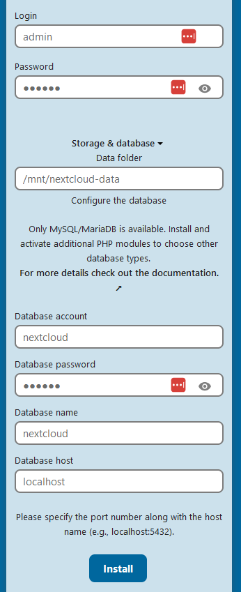

# Aufgabe 3

Führt das mysql_secure_installation Script aus und sichert den Datenbankserver ab, indem ein Root Passwort setzt, sowie der Anonymous Account und die Testdatenbank gelöscht wird.

`sudo /usr/bin/mysql_secure_installation`


Set the Root Password (comstomized pd of root: 1 to 6 ): 

    You may be prompted to set or update the root user password for the MySQL server.
    Example:

    Enter current password for root (enter for none): 
    Set root password? [Y/n] Y
    New password: 
    Re-enter new password: 

    Tip: Use a strong, unique password.


Remove Anonymous Users:

    Anonymous users are created by default but are a security risk.
    Recommendation: Remove them by typing Y.

Disallow Remote Root Login:

    The root user should typically only connect locally for security reasons.
    Recommendation: Disallow by typing Y.

Remove Test Database and Access:

    A test database is created during installation, which can be exploited if left accessible.
    Recommendation: Remove by typing Y.

Reload Privilege Tables:

    This ensures changes take effect immediately.
    Type Y to confirm.


# Aufgabe 4

Erstellt eine Datenbank für Nextcloud. Zusätzlich soll ein User erstellt werden, welcher von lokal und remote auf die Datenbank zugreifen und diese bearbeiten darf.

To start the MySQL command line mode use the following command:

`sudo mysql`

Then a MariaDB [root]> prompt will appear. Now enter the following lines, replacing username and password with appropriate values, and confirm them with the Enter key:

```
CREATE USER 'username'@'localhost' IDENTIFIED BY 'password';

CREATE USER 'nextcloud'@'localhost' IDENTIFIED BY '123456';


CREATE DATABASE IF NOT EXISTS nextcloud CHARACTER SET utf8mb4 COLLATE utf8mb4_general_ci;

GRANT ALL PRIVILEGES ON nextcloud.* TO 'username'@'localhost';
GRANT ALL PRIVILEGES ON nextcloud.* TO 'nextcloud'@'localhost';


FLUSH PRIVILEGES;
```

You can quit the prompt by entering:

`quit;
`
# Aufgabe 5

Erstellt einen Ordner für die Daten der Nextcloud User in /mnt/nextcloud-data.

```
sudo mkdir -p /mnt/nextcloud-data
sudo chown -R www-data:www-data /mnt/nextcloud-data
sudo chmod 750 /mnt/nextcloud-data

```


# Aufgabe 6:


## download and unpack Nextcloud Archiv
Ladet das aktuellste Nextcloud Archiv für Server von der offiziellen Download Seite herunter: https://download.nextcloud.com/server/releases/latest.zip
Entpackt und verschiebt es dann in das Basisverzeichnis des Apache2 Webservers (/var/www/).

```
# Aktuellstes Nextcloud-Archiv herunterladen
wget https://download.nextcloud.com/server/releases/latest.zip -O /tmp/nextcloud-latest.zip

# Archiv entpacken
unzip /tmp/nextcloud-latest.zip -d /tmp/

# Verschieben in das Apache2-Basisverzeichnis
sudo mv /tmp/nextcloud /var/www/

# Eigentümer ändern, damit der Webserver Zugriff hat
sudo chown -R www-data:www-data /var/www/nextcloud

# Berechtigungen setzen
sudo chmod -R 750 /var/www/nextcloud

# Aufräumen (entfernen des Archivs)
rm /tmp/nextcloud-latest.zip

echo "Nextcloud wurde erfolgreich in /var/www/nextcloud installiert."

```

#  Apache Web server configuration for NextCloud

```
sudo bash -c 'cat > /etc/apache2/sites-available/nextcloud.conf <<EOF
Alias /nextcloud "/var/www/nextcloud/"

<VirtualHost *:80>
  DocumentRoot /var/www/nextcloud/
  ServerName  your.server.com

  <Directory /var/www/nextcloud/>
    Require all granted
    AllowOverride All
    Options FollowSymLinks MultiViews

    <IfModule mod_dav.c>
      Dav off
    </IfModule>
  </Directory>
</VirtualHost>
EOF'
```

then execute 
`sudo a2ensite nextcloud.conf`

## addtional 

```sh
# Apache-Module aktivieren:
sudo a2enmod rewrite headers env dir mime

# Apache-Dienst neu starten:
sudo systemctl restart apache2

```
# Aufgabe 7
Konfiguriert Nextcloud im Browser durch Aufrufen der externen IP Adresse der virtuellen Maschine: Erstellt einen Admin Account und nutzt die vorher erstellte Datenbank sowie den in Aufgabe 5 erstellten Daten-Ordner.




Login and password: Admin Account of nexcloud. costomized by user

Storage & database Data folder: defined in Aufgabe 5

Database info: 
(`CREATE USER 'username'@'localhost' IDENTIFIED BY 'password';`)
(`CREATE DATABASE IF NOT EXISTS nextcloud CHARACTER SET utf8mb4 COLLATE utf8mb4_general_ci;`)
- Database account: defined username in Aufgabe6
- Database password: defined password in Aufgabe6
- Databbase name: defined in Aufgabe6
- Databbase host: hostname of DB , defined in Aufgabe6

